# Azure & AWS Cross-Cloud Database Integration (Lab Project) 🌐

This lab project demonstrates how to integrate AWS and Azure using a **site-to-site VPN**. The goal was to connect an **AWS RDS MySQL database** and an **Azure MySQL database** through an **Azure App Service running phpMyAdmin**. The VPN enables secure cross-cloud communication, allowing phpMyAdmin to manage both databases.

## 📌 Project Overview
This lab project was created to **test and apply cloud networking concepts** by integrating AWS and Azure using a **site-to-site VPN**. The goal was to enable secure cross-cloud database communication between an **AWS RDS MySQL instance** and an **Azure MySQL database**, accessible via a **containerized phpMyAdmin instance running on Azure App Service**.

This project allowed me to experiment with:
- **Site-to-site VPN setup** between AWS and Azure
- **Private networking and service integration** (Azure Private Endpoint, AWS RDS subnet groups)
- **Containerized application deployment** using Azure App Service

💡 *Since this was a lab project, all resources were temporary and have been decommissioned.*

---

## 🖼️ Network Architecture Diagram
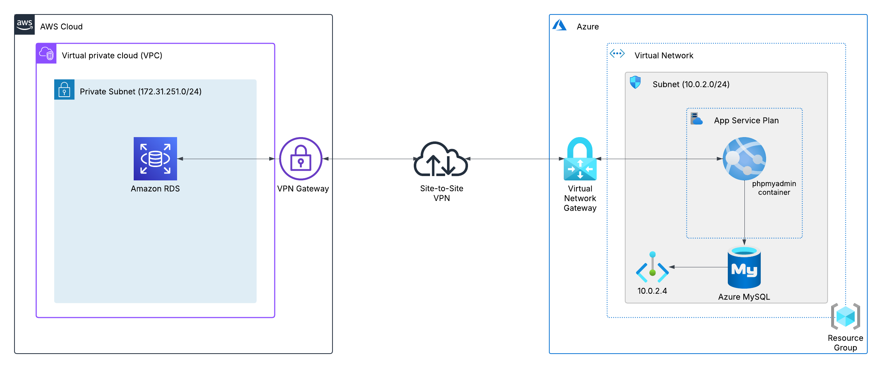

---

## 🚀 Azure Infrastructure
### Azure App Service & Container
- **App Service running phpMyAdmin**
- Connected to **Azure MySQL** via **Private Endpoint**  
- Connected to **AWS RDS MySQL** via **VPN**

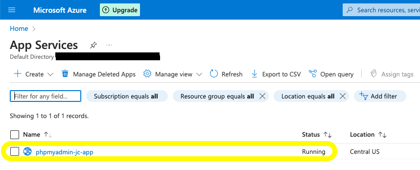
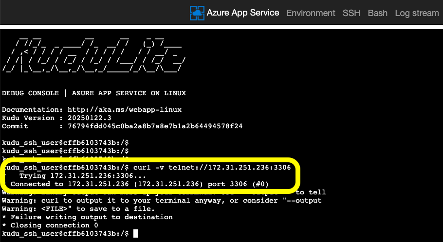

### Azure Virtual Network (VNet)
- Contains subnets for App Service, Private Endpoint, and VPN Gateway  
- CIDR: *(shown in the screenshot below)*

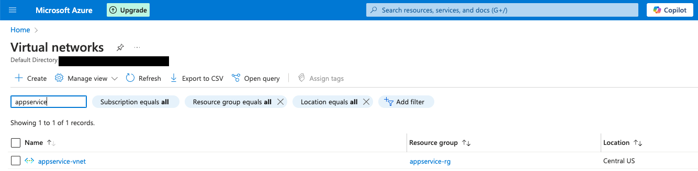

### Azure VPN Gateway & Connection
- **VPN Tunnel** to AWS (*Status: Connected*)  
- Allows secure traffic between **Azure and AWS VPC**

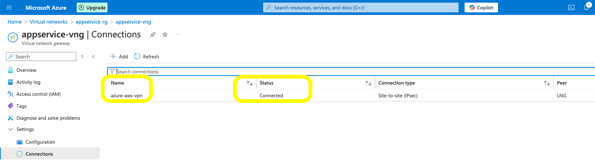

### Azure MySQL Database
- **Private Endpoint created** for secure internal access
- **Metrics Monitoring** for database performance

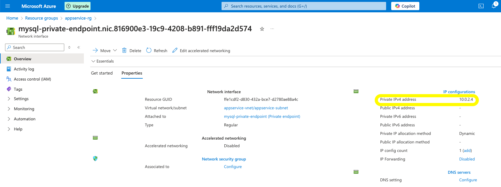
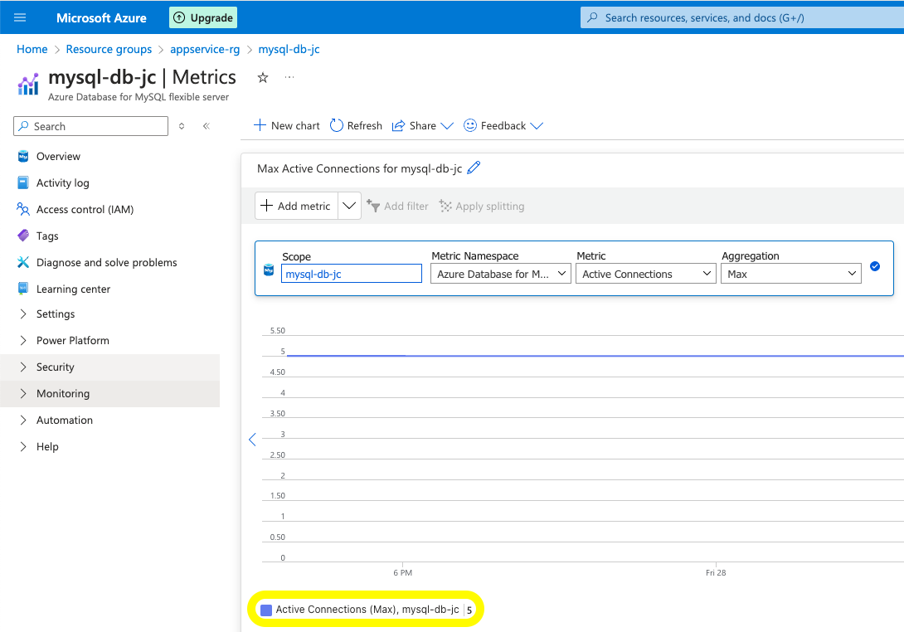

---

## ☁️ AWS Infrastructure
### AWS VPN & RDS Configuration
- **AWS Virtual Private Gateway (VGW)** connects to Azure
- **AWS RDS MySQL** deployed in a **private subnet group**
- **Elastic Network Interface (ENI)** for the RDS instance

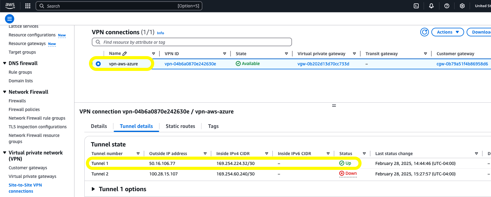
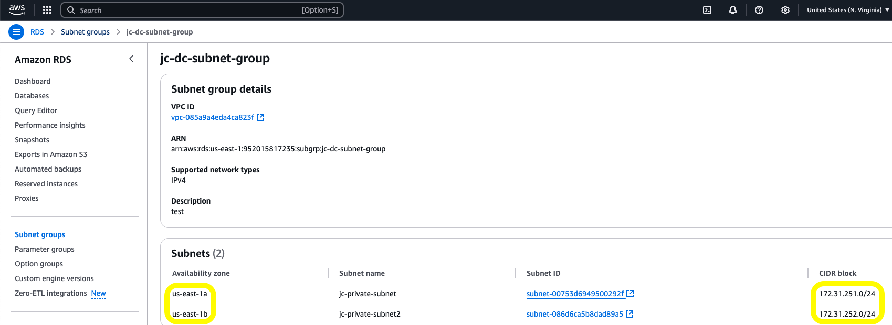
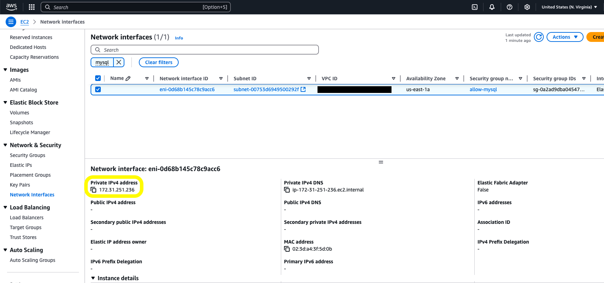

### AWS RDS MySQL Database
- Database instance and name visible in RDS console

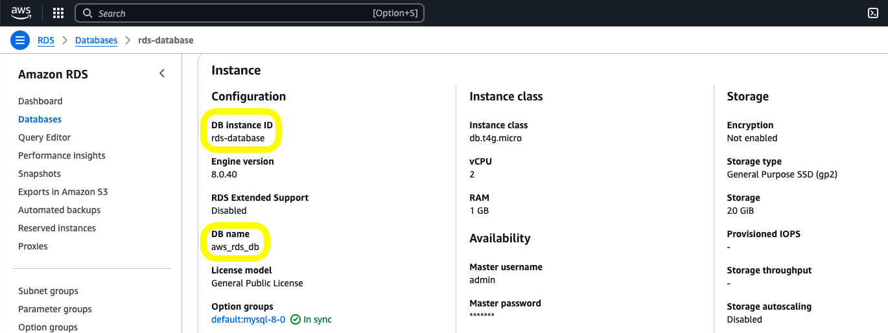

---

## 🖥️ phpMyAdmin Setup
### phpMyAdmin Login & Connection
- phpMyAdmin deployed as a **containerized app** in Azure
- Provides access to **both databases** (AWS RDS & Azure MySQL)

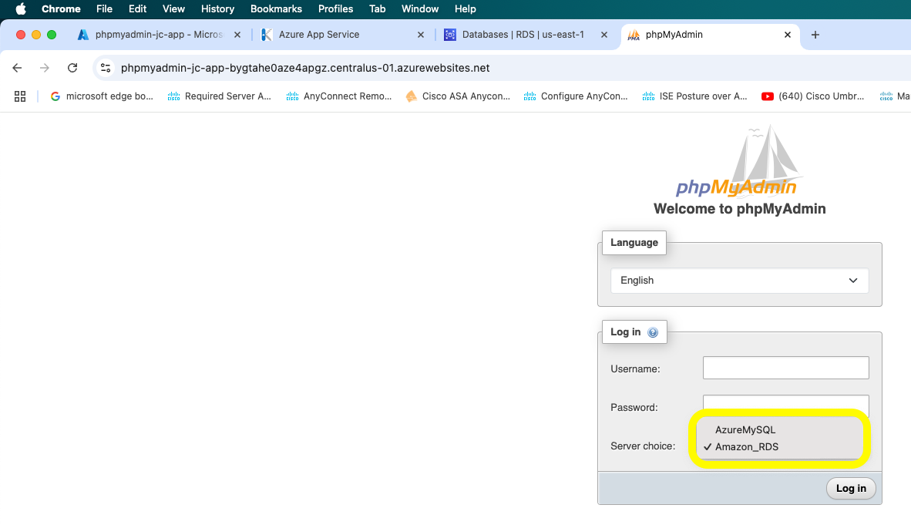
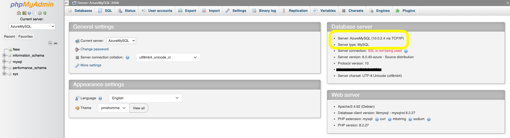
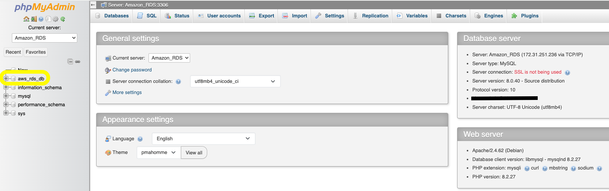

---

## 📸 Screenshots
*(All screenshots are stored in this repository in the project_screenshots directory.)*

---

## 📂 Project Files

This repository contains resources used to test the **phpMyAdmin container** in a cross-cloud setup between **AWS** and **Azure**. Below are the key files included:

- **Dockerfile** - Used to build and run the **phpMyAdmin** container with the necessary configurations.
- **README.md** - Project documentation, including architecture details and setup instructions.
- **Screenshots** - Various images showcasing the **VPN setup, database connections, and infrastructure** across both cloud providers.

---

**Project completed! ✅**
